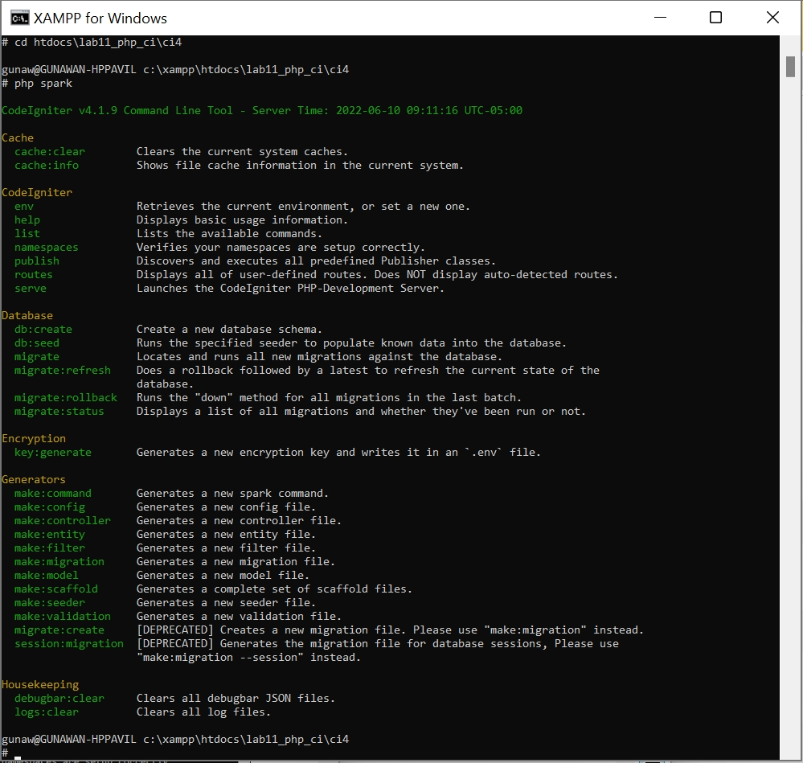
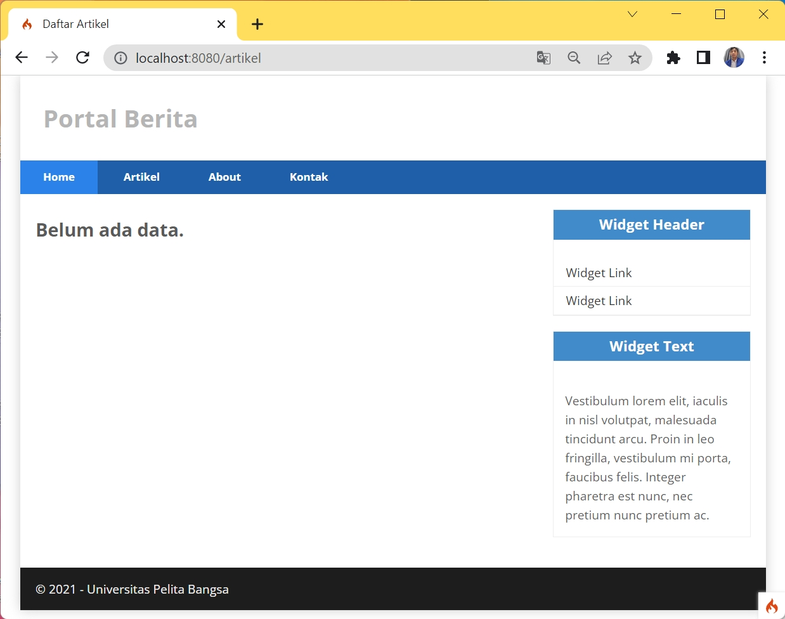
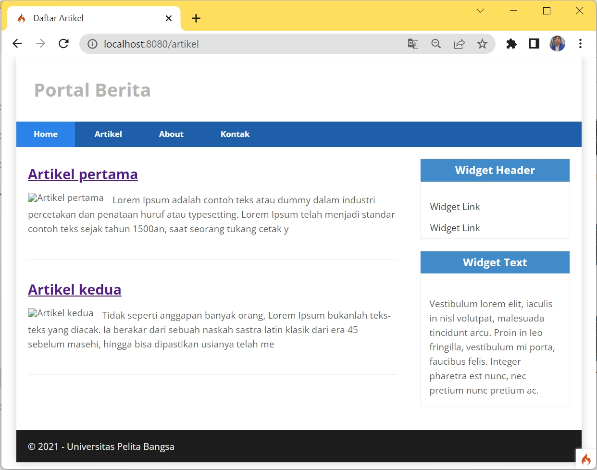
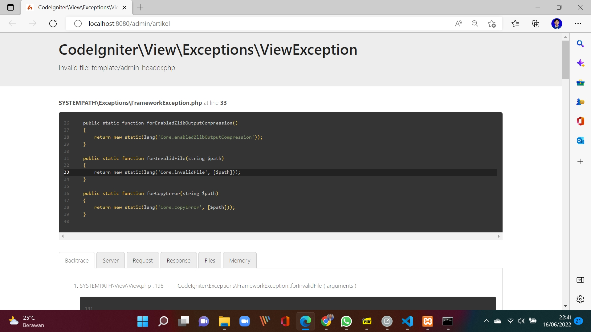

# 11_Lab11Web

<Hr>

TUGAS PERTEMUAN 12<br>
PEMROGRAMAN WEB<br>
TEKNIK INFORMATIKA<br>
UNIVERSITAS PELITA BANGSA<br>

| NAMA  :| GUNAWAN |
| --- | --- |
| NIM   :| 312010191 |
| KELAS :| TI.20.B1 |
| DOSEN :| Agung Nugroho,S.Kom.,M.Kom |

<Hr>

# Pemrograman Web: PHP  Framework (Codeigniter)

<hr>

**Instruksi Praktikum**<br>
1. Persiapkan text editor misalnya VSCode.
2. Buat folder baru dengan nama **lab11_php_ci** pada docroot webserver **(htdocs)**
3. Ikuti langkah-langkah praktikum yang akan dijelaskan berikutnya.

**Langkah-langkah Praktikum**<br>
**Persiapan**<br>
Sebelum memulai menggunakan Framework Codeigniter, perlu dilakukan konfigurasi 
pada webserver. Beberapa ekstensi PHP perlu diaktifkan untuk kebutuhan 
pengembangan Codeigniter 4.
Berikut beberapa ekstensi yang perlu diaktifkan:
• php-json ekstension untuk bekerja dengan JSON;
• php-mysqlnd native driver untuk MySQL;
• php-xml ekstension untuk bekerja dengan XML;
• php-intl ekstensi untuk membuat aplikasi multibahasa;
• libcurl (opsional), jika ingin pakai Curl.<br>

Untuk mengaktifkan ekstentsi tersebut, melalu **XAMPP Control Panel**, pada bagian 
Apache **klik Config -> PHP.ini**
Untuk menjalankan MySQL Server dari menu XAMPP Contol.


Gambar 01. Konfigurasi PHP

Pada bagian extention, hilangkan tanda ; (titik koma) pada ekstensi yang akan 
diaktifkan. Kemudian simpan kembali filenya dan restart Apache web server.


Gambar 02. Ekstensi PHP

**`Instalasi Codeigniter 4`**

Untuk melakukan instalasi Codeigniter 4 dapat dilakukan dengan dua cara, yaitu cara 
manual dan menggunakan **composer**. Pada praktikum ini kita menggunakan cara 
manual.<br>
• Unduh **Codeigniter** dari website https://codeigniter.com/download<br>
• Extrak file zip Codeigniter ke direktori **htdocs/lab11_ci**.<br>
• Ubah nama direktory **framework-4.x.xx** menjadi **ci4**.<br>


Gambar 03. Direktory framework-4 ci4

• Buka browser dengan alamat **http://localhost/lab11_php_ci/ci4/public/**


Gambar 04. Tampilan Codeigniter4

**`Menjalankan CLI (Command Line Interface)`**

Codeigniter 4 menyediakan CLI untuk mempermudah proses development. Untuk 
mengakses CLI buka terminal/command prompt. 


Gambar 05. Tampilan Command Prompt

Arahkan lokasi direktori sesuai dengan direktori kerja project dibuat **(xampp/htdocs/lab11_php_ci/ci4/)** 
Perintah yang dapat dijalankan untuk memanggil CLI Codeigniter adalah:

~~~
php spark
~~~



Gambar 06. Perintah CLI

lalu jalankan perintah

~~~
php spark serve
~~~

**`Mengaktifkan Mode Debugging`**<br>

Codeigniter 4 menyediakan fitur **debugging** untuk memudahkan developer untuk 
mengetahui pesan error apabila terjadi kesalahan dalam membuat kode program.

**Secara default fitur ini belum aktif. Ketika terjadi error pada aplikasi akan ditampilkan
pesan kesalahan seperti berikut.**


Gambar 07. CI Error

Cara mengaktifkannya dengan mengubah nama file **env** menjadi **.env** kemudian buka filenya dan ubah nilai **CI_ENVIRONMENT** menjadi **development.**


Gambar 08. Konfigurasi CI

Contoh error yang terjadi. Untuk mencoba error tersebut, ubah kode pada file
**app/Controller/Home.php** hilangkan titik koma pada akhir kode.


Gambar 09. Kode Home

Buka browser : http://localhost:8080


Gambar 10. Error

**Membuat Route Baru.**

Tambahkan kode berikut di dalam **Routes.php**
~~~
$routes->get('/about', 'Page::about');
$routes->get('/contact', 'Page::contact');
$routes->get('/faqs', 'Page::faqs');
~~~


Gambar 11. Gambar add app config Routes.php

Untuk mengetahui route yang ditambahkan sudah benar, buka CLI dan jalankan
perintah berikut.

`php spark routes`


Gambar 12. Tampilan CLI

Selanjutnya coba akses route yang telah dibuat dengan mengakses alamat url
http://localhost:8080/about


Gambar 13. Tampilan error page.

Ketika diakses akan mucul tampilan error 404 file not found, itu artinya file/page
tersebut tidak ada. Untuk dapat mengakses halaman tersebut, harus dibuat terlebih
dahulu Contoller yang sesuai dengan routing yang dibuat yaitu Contoller Page.

**Membuat Controller**

Selanjutnya adalah membuat Controller Page. Buat file baru dengan nama **page.php** di dalam direktori Controller (/app/Controllers).<br>
Pada direktori Controller kemudian isi kodenya seperti berikut.
~~~
<?php
namespace App\Controllers;
class Page extends BaseController
{
public function about()
{
echo "Ini halaman About";
}
public function contact()
{
echo "Ini halaman Contact";
}
public function faqs()
{
echo "Ini halaman FAQ";
}
}
~~~


Gambar 14. Code Controller Page.php

Selanjutnya refresh Kembali browser, maka akan ditampilkan hasilnya yaitu halaman
sudah dapat diakses.


Gambar 14. Tampilan Halaman About

**Auto Routing**
Secara default fitur autoroute pada Codeiginiter sudah aktif. Untuk mengubah status
autoroute dapat mengubah nilai variabelnya. Untuk menonaktifkan ubah nilai true
menjadi false.
~~~
$routes->setAutoRoute(true);
~~~
Tambahkan method baru pada Controller Page seperti berikut.
~~~
public function tos()
{
echo "ini halaman Term of Services";
}
~~~

Method ini belum ada pada routing, sehingga cara mengaksesnya dengan menggunakan
alamat: http://localhost:8080/page/tos


Gambar 15. Tampilan autoroute

**Membuat View**

Selanjutnya adalam membuat view untuk tampilan web agar lebih menarik. Buat file
baru dengan nama **about.php** pada direktori view **(app/view/about.php)** kemudian isi
kodenya seperti berikut.
~~~
<!DOCTYPE html>
<html lang="en">
<head>
<meta charset="UTF-8">
<title><?= $title; ?></title>
</head>
<body>
<h1><?= $title; ?></h1>
<hr>
<p><?= $content; ?></p>
</body>
</html>
~~~


Gambar 16. Code app view about.php

Ubah **method about** pada class **Controller Page** menjadi seperti berikut:
~~~
public function about()
{
return view('about', [
'title' => 'Halaman Abot',
'content' => 'Ini adalah halaman abaut yang menjelaskan tentang isi
halaman ini.'
]);
}
~~~


Gambar 17. Code Controller Page

Kemudian lakukan refresh pada halaman tersebut.


Gambar 18.Halaman about

**Membuat Layout Web dengan CSS**

Pada dasarnya layout web dengan css dapat diimplamentasikan dengan mudah pada
codeigniter. Yang perlu diketahui adalah, pada Codeigniter 4 file yang menyimpan asset
css dan javascript terletak pada direktori **public**.<br>
Buat file css pada direktori public dengan nama **style.css** (copy file dari praktikum
**lab4_layout**). Kita akan gunakan layout yang pernah dibuat pada praktikum 4.


Gambar 19.Direktori asset

Kemudian buat folder **template** pada direktori **view** kemudian buat file **header.php** dan
**footer.php**<br>
File **app/view/template/header.php**<br>
~~~
<!DOCTYPE html>
<html lang="en">
<head>
<meta charset="UTF-8">
<title><?= $title; ?></title>
<link rel="stylesheet" href="<?= base_url('/style.css');?>">
</head>
<body>
<div id="container">
<header>
<h1>Layout Sederhana</h1>
</header>
<nav>
<a href="<?= base_url('/');?>" class="active">Home</a>
<a href="<?= base_url('/artikel');?>">Artikel</a>
<a href="<?= base_url('/about');?>">About</a>
<a href="<?= base_url('/contact');?>">Kontak</a>
</nav>
<section id="wrapper">
<section id="main">
~~~


Gambar 20.Code header.php

File **app/view/template/footer.php**
~~~
</section>
<aside id="sidebar">
<div class="widget-box">
<h3 class="title">Widget Header</h3>
<ul>
<li><a href="#">Widget Link</a></li>
<li><a href="#">Widget Link</a></li>
</ul>
</div>
<div class="widget-box">
<h3 class="title">Widget Text</h3>
<p>Vestibulum lorem elit, iaculis in nisl volutpat, malesuada
tincidunt arcu. Proin in leo fringilla, vestibulum mi porta, faucibus felis.
Integer pharetra est nunc, nec pretium nunc pretium ac.</p>
</div>
</aside>
</section>
<footer>
<p>&copy; 2021 - Universitas Pelita Bangsa</p>
</footer>
</div>
</body>
</html>
~~~


Gambar 21.Code footer.php

Kemudian ubah file **app/view/about.php** seperti berikut.
~~~
<?= $this->include('template/header'); ?>
<h1><?= $title; ?></h1>
<hr>
<p><?= $content; ?></p>
<?= $this->include('template/footer'); ?>
~~~


Gambar 22.Code about.php

Selanjutnya refresh tampilan pada alamat http://localhost:8080/about


Gambar 22.Tampilan web about

<hr>

**`Pertanyaan dan Tugas`**

Lengkapi kode program untuk menu lainnya yang ada pada Controller Page, sehingga
semua link pada navigasi header dapat menampilkan tampilan dengan layout yang
sama.
<hr>

 >**Jawab**
 
 
Di atas sudah kita buat Route jadi kita tinggal.
Tambahkan kode **Route artikel** di dalam **Routes.php**


Gambar 23.add_Routes_artikel

Untuk mengetahui route yang ditambahkan sudah benar, buka CLI dan jalankan
perintah berikut.

`php spark routes`


Gambar 24.add_Routes_artikel_CLI

Selanjutnya kita buat Buat dan tambahkan file
baru dengan nama **artikel.php dan contact.php** di **htdocs\lab11_php_ci\ci4\app\Views**

hasil : buka web Browser 

**`Tampilan page about:`**


Gambar 25.Halaman about

**`Tampilan page artikel:`**


Gambar 26.Halaman artikel

**`Tampilan page Kontak:`**


Gambar 27.Halaman contact

<hr>

# TUGAS PERTEMUAN 12

<hr>

**Praktikum 12: Framework Lanjutan (CRUD)**

**Pemrograman Web: Framework Lanjutan (CRUD)**

<hr>

**Instruksi Praktikum**
1. Persiapkan text editor misalnya **VSCode**.
2. Buka kembali folder dengan nama **lab11_php_ci** pada docroot webserver **(htdocs)**
3. Ikuti langkah-langkah praktikum yang akan dijelaskan berikutnya.<br>

**Langkah-langkah Praktikum
Persiapan.**
Untuk memulai membuat aplikasi CRUD sederhana, yang perlu disiapkan adalah 
database server menggunakan MySQL. Pastikan MySQL Server sudah dapat dijalankan 
melalui XAMPP.

**Membuat Database: Studi Kasus Data Artikel**


**`Membuat Database`**

```
CREATE DATABASE lab_ci4;
```


Gambar 28.CREATE DATABASE

**`Membuat Tabel`**
```
CREATE TABLE artikel (
id INT(11) auto_increment,
judul VARCHAR(200) NOT NULL,
isi TEXT,
gambar VARCHAR(200),
status TINYINT(1) DEFAULT 0,
slug VARCHAR(200),
PRIMARY KEY(id)
);
```


Gambar 29.Membuat Tabel


**`Konfigurasi koneksi database`**

Selanjutnya membuat konfigurasi untuk menghubungkan dengan database server.
Konfigurasi dapat dilakukan dengan du acara, yaitu pada file **app/config/database.php**
atau menggunakan file **.env**. Pada praktikum ini kita gunakan konfigurasi pada file .env.


Gambar 30.Konfigurasi Database

**`Membuat Model`**

Selanjutnya adalah membuat Model untuk memproses data Artikel. Buat file baru pada
direktori **app/Models** dengan nama **ArtikelModel.php**
```
<?php
namespace App\Models;
use CodeIgniter\Model;
class ArtikelModel extends Model
{
protected $table = 'artikel';
protected $primaryKey = 'id';
protected $useAutoIncrement = true;
protected $allowedFields = ['judul', 'isi', 'status', 'slug', 'gambar'];
}
```


Gambar 31.ArtikelModel.php

**`Membuat Controller`**

Buat Controller baru dengan nama ***Artikel.php*** pada direktori ***app/Controllers***.
```
<?php
namespace App\Controllers;
use App\Models\ArtikelModel;
class Artikel extends BaseController
{
   public function index()
  {
  $title = 'Daftar Artikel';
  $model = new ArtikelModel();
  $artikel = $model->findAll();
  return view('artikel/index', compact('artikel', 'title'));
  }
}
```


Gambar 32.Artikel.php

**`Membuat View`**

Buat direktori baru dengan nama ***artikel*** pada direktori ***app/views***, kemudian buat file
baru dengan nama ***index.php***.
```
<?= $this->include('template/header'); ?>

<?php if($artikel): foreach($artikel as $row): ?>
    <article class="entry">
    <h2><a href="<?= base_url('/artikel/' . $row['slug']);?>"><?= $row['judul']; ?></a>
</h2>
    " alt="<?= $row['judul']; ?>">
    <p><?= substr($row['isi'], 0, 200); ?></p>
</article>
<hr class="divider" />
<?php  endforeach; else: ?>
<article class="entry">
    <h2>Belum ada data.</h2>
</article>
<?php endif; ?>
<?= $this->include('template/footer'); ?>
```


Gambar 33.index.php

Selanjutnya buka browser kembali, dengan mengakses url http://localhost:8080/artikel



Gambar 34.Tampilan Web.Artikel

Belum ada data yang diampilkan. Kemudian coba tambahkan beberapa data pada
***Database*** agar dapat ditampilkan datanya.
```
INSERT INTO artikel (judul, isi, slug) VALUE
('Artikel pertama', 'Lorem Ipsum adalah contoh teks atau dummy dalam industri
percetakan dan penataan huruf atau typesetting. Lorem Ipsum telah menjadi
standar contoh teks sejak tahun 1500an, saat seorang tukang cetak yang tidak
dikenal mengambil sebuah kumpulan teks dan mengacaknya untuk menjadi sebuah
buku contoh huruf.', 'artikel-pertama'),
('Artikel kedua', 'Tidak seperti anggapan banyak orang, Lorem Ipsum bukanlah
teks-teks yang diacak. Ia berakar dari sebuah naskah sastra latin klasik dari
era 45 sebelum masehi, hingga bisa dipastikan usianya telah mencapai lebih
dari 2000 tahun.', 'artikel-kedua');
```


Gambar 35.add database.Artikel

Refresh kembali browser, sehingga akan ditampilkan hasilnya.



Gambar 36.Tampilan Artikel

**`Membuat Tampilan Detail Artikel`**

Tampilan pada saat judul berita di klik maka akan diarahkan ke halaman yang berbeda.
Tambahkan fungsi baru pada ***Controller Artikel*** dengan nama ***view()***.
```
public function view($slug)
    {
         $model = new ArtikelModel();
         $artikel = $model->where([
         'slug' => $slug
         ])->first();
         
         // Menampilkan error apabila data tidak ada.
         if (!$artikel)
         {
             throw PageNotFoundException::forPageNotFound();
         }
       $title = $artikel['judul'];
       return view('artikel/detail', compact('artikel', 'title'));
    }
    public function admin_index()
   {
    $title = 'Daftar Artikel';
    $model = new ArtikelModel();
    $artikel = $model->findAll();
    return view('artikel/admin_index', compact('artikel', 'title'));
   }
   ```


Gambar 37.Controller_Artikel

**`Membuat View Detail`**

Buat view baru untuk halaman detail dengan nama ***app/views/artikel/detail.php***.
```
<?= $this->include('template/header'); ?>
<article class="entry">
<h2><?= $artikel['judul']; ?></h2>
" alt="<?=
$artikel['judul']; ?>">
<p><?= $row['isi']; ?></p>
</article>
<?= $this->include('template/footer'); ?>
```


Gambar 38.View detail.php

**`Membuat Routing untuk artikel detail`**

Buka Kembali file ***app/config/Routes.php***, kemudian tambahkan routing untuk artikel
detail.
```
$routes->get('/artikel/(:any)', 'Artikel::view/$1');
```


Gambar 39.routes.Artikel

Refresh kembali browser, sehingga akan ditampilkan hasilnya.


Gambar 40.Detail Artikel

**`Membuat Menu Admin`**

Menu admin adalah untuk proses CRUD data artikel. Buat method baru pada
***Controller Artikel*** dengan nama ***admin_index()***.
```
public function admin_index()
{
$title = 'Daftar Artikel';
$model = new ArtikelModel();
$artikel = $model->findAll();
return view('artikel/admin_index', compact('artikel', 'title'));
}
```


Gambar 41.Controller_Artikel_admin_index

Selanjutnya buat view untuk tampilan admin dengan nama ***admin_index.php***
```
<?= $this->include('template/admin_header'); ?>

<table class="table">
    <thead>
       <tr>
          <th>ID</th>
          <th>Judul</th>
          <th>Status</th>
          <th>AKsi</th>
     </tr>
    </thead>
    <tbody>
    <?php if($artikel): foreach($artikel as $row): ?>
    <tr>
       <td><?= $row['id']; ?></td>
       <td>
          <b><?= $row['judul']; ?></b>
          <p><small><?= substr($row['isi'], 0, 50); ?></small></p>
       </td>
       <td><?= $row['status']; ?></td>
       <td>
          <a class="btn" href="<?= base_url('/admin/artikel/edit/' .
$row['id']);?>">Ubah</a>
            <a class="btn btn-danger" onclick="return confirm('Yakin menghapus data?');" href="<?= base_url('/admin/artikel/delete/' .
$row['id']);?>">Hapus</a>
    </td>
    </tr>
    <?php endforeach; else: ?>
    <tr>
       <td colspan="4">Belum ada data.</td>
     </tr>
     <?php endif; ?>
     </tbody>
     <tfoot>
        <tr>
           <th>ID</th>
           <th>Judul</th>
           <th>Status</th>
           <th>AKsi</th>
        </tr>
     </tfoot>
 </table>
 
<?= $this->include('template/admin_footer'); ?>
```


Gambar 42.admin_index.php

Tambahkan routing untuk menu admin seperti berikut:
```
$routes->group('admin', function($routes) {
$routes->get('artikel', 'Artikel::admin_index');
$routes->add('artikel/add', 'Artikel::add');
$routes->add('artikel/edit/(:any)', 'Artikel::edit/$1');
$routes->get('artikel/delete/(:any)', 'Artikel::delete/$1');
});
```


Gambar 43.add routing.php

Akses menu admin dengan url http://localhost:8080/admin/artikel



Gambar 44.ERROR


