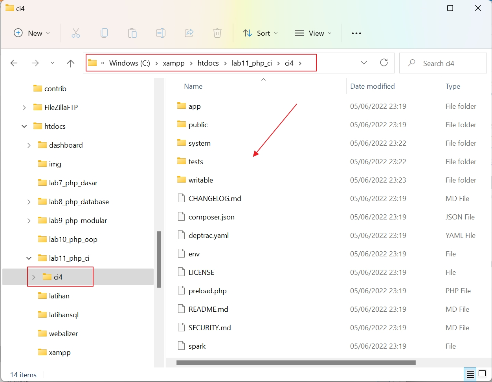
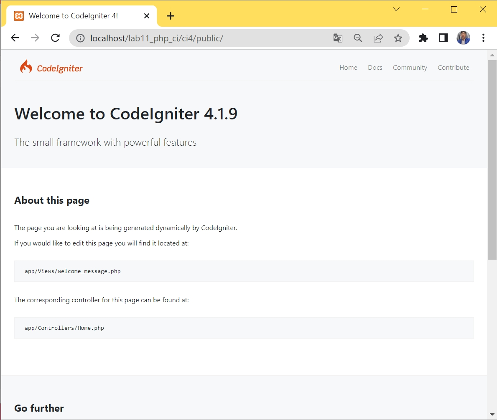

# 11_Lab11Web

| TUGAS PERTEMUAN 11 |
| PEMROGRAMAN WEB |
| TEKNIK INFORMATIKA |
| UNIVERSITAS PELITA BANGSA |
| --- | --- |
| NAMA  :| GUNAWAN |
| NIM   :| 312010191 |
| KELAS :| TI.20.B1 |
| DOSEN :| Agung Nugroho,S.Kom.,M.Kom |

# Pemrograman Web: PHP  Framework (Codeigniter)

**Instruksi Praktikum** 
1. Persiapkan text editor misalnya VSCode.
2. Buat folder baru dengan nama **lab11_php_ci** pada docroot webserver **(htdocs)**
3. Ikuti langkah-langkah praktikum yang akan dijelaskan berikutnya.

**Langkah-langkah Praktikum** 
**Persiapan** 
Sebelum memulai menggunakan Framework Codeigniter, perlu dilakukan konfigurasi 
pada webserver. Beberapa ekstensi PHP perlu diaktifkan untuk kebutuhan 
pengembangan Codeigniter 4.
Berikut beberapa ekstensi yang perlu diaktifkan:
• php-json ekstension untuk bekerja dengan JSON;
• php-mysqlnd native driver untuk MySQL;
• php-xml ekstension untuk bekerja dengan XML;
• php-intl ekstensi untuk membuat aplikasi multibahasa;
• libcurl (opsional), jika ingin pakai Curl. 

Untuk mengaktifkan ekstentsi tersebut, melalu **XAMPP Control Panel**, pada bagian 
Apache **klik Config -> PHP.ini**
Untuk menjalankan MySQL Server dari menu XAMPP Contol.

Gambar 01. Konfigurasi PHP

Pada bagian extention, hilangkan tanda ; (titik koma) pada ekstensi yang akan 
diaktifkan. Kemudian simpan kembali filenya dan restart Apache web server.

Gambar 02. Ekstensi PHP

**`Instalasi Codeigniter 4`**

Untuk melakukan instalasi Codeigniter 4 dapat dilakukan dengan dua cara, yaitu cara 
manual dan menggunakan **composer**. Pada praktikum ini kita menggunakan cara 
manual.
• Unduh **Codeigniter** dari website https://codeigniter.com/download
• Extrak file zip Codeigniter ke direktori **htdocs/lab11_ci**.
• Ubah nama direktory **framework-4.x.xx** menjadi **ci4**.

Gambar 03. Direktory framework-4 ci4

• Buka browser dengan alamat **http://localhost/lab11_php_ci/ci4/public/**

Gambar 04. Tampilan Codeigniter4

**`Menjalankan CLI (Command Line Interface)`**

Codeigniter 4 menyediakan CLI untuk mempermudah proses development. Untuk 
mengakses CLI buka terminal/command prompt. 

Gambar 05. Tampilan Command Prompt

Arahkan lokasi direktori sesuai dengan direktori kerja project dibuat **(xampp/htdocs/lab11_php_ci/ci4/)** 
Perintah yang dapat dijalankan untuk memanggil CLI Codeigniter adalah:

~~~
php spark
~~~

Gambar 06. Perintah CLI

lalu jalankan perintah

~~~
php spark serve
~~~

**`Mengaktifkan Mode Debugging`** 

Codeigniter 4 menyediakan fitur **debugging** untuk memudahkan developer untuk 
mengetahui pesan error apabila terjadi kesalahan dalam membuat kode program.

Cara mengaktifkannya dengan mengubah nama file **env** menjadi **.env** kemudian buka filenya dan ubah nilai **CI_ENVIRONMENT** menjadi **development.**

Gambar 07. Konfigurasi_CI