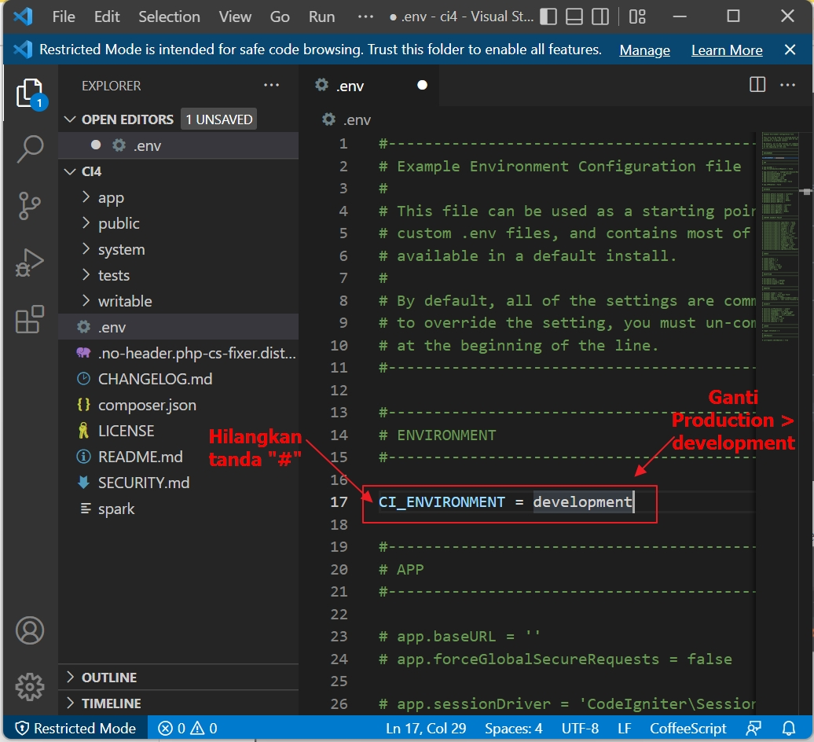
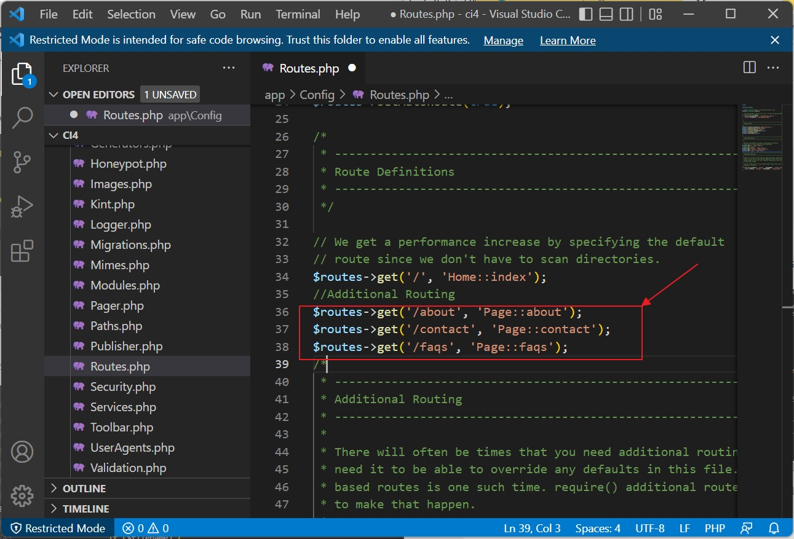
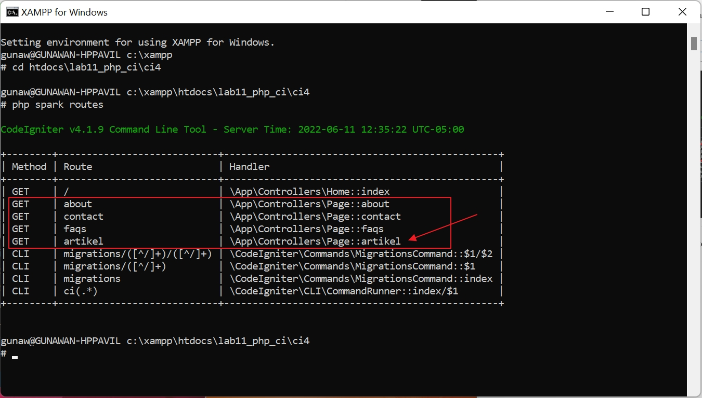

# 11_Lab11Web

TUGAS PERTEMUAN 12 
PEMROGRAMAN WEB 
TEKNIK INFORMATIKA 
UNIVERSITAS PELITA BANGSA 

| NAMA  :| GUNAWAN |
| --- | --- |
| NIM   :| 312010191 |
| KELAS :| TI.20.B1 |
| DOSEN :| Agung Nugroho,S.Kom.,M.Kom |

# Pemrograman Web: PHP  Framework (Codeigniter)

**Instruksi Praktikum** 
1. Persiapkan text editor misalnya VSCode.
2. Buat folder baru dengan nama **lab11_php_ci** pada docroot webserver **(htdocs)**
3. Ikuti langkah-langkah praktikum yang akan dijelaskan berikutnya.

**Langkah-langkah Praktikum** 
**Persiapan** 
Sebelum memulai menggunakan Framework Codeigniter, perlu dilakukan konfigurasi 
pada webserver. Beberapa ekstensi PHP perlu diaktifkan untuk kebutuhan 
pengembangan Codeigniter 4.
Berikut beberapa ekstensi yang perlu diaktifkan:
• php-json ekstension untuk bekerja dengan JSON;
• php-mysqlnd native driver untuk MySQL;
• php-xml ekstension untuk bekerja dengan XML;
• php-intl ekstensi untuk membuat aplikasi multibahasa;
• libcurl (opsional), jika ingin pakai Curl. 

Untuk mengaktifkan ekstentsi tersebut, melalu **XAMPP Control Panel**, pada bagian 
Apache **klik Config -> PHP.ini**
Untuk menjalankan MySQL Server dari menu XAMPP Contol.

Gambar 01. Konfigurasi PHP

Pada bagian extention, hilangkan tanda ; (titik koma) pada ekstensi yang akan 
diaktifkan. Kemudian simpan kembali filenya dan restart Apache web server.

Gambar 02. Ekstensi PHP

**`Instalasi Codeigniter 4`**

Untuk melakukan instalasi Codeigniter 4 dapat dilakukan dengan dua cara, yaitu cara 
manual dan menggunakan **composer**. Pada praktikum ini kita menggunakan cara 
manual. 
• Unduh **Codeigniter** dari website https://codeigniter.com/download 
• Extrak file zip Codeigniter ke direktori **htdocs/lab11_ci**. 
• Ubah nama direktory **framework-4.x.xx** menjadi **ci4**. 

Gambar 03. Direktory framework-4 ci4

• Buka browser dengan alamat **http://localhost/lab11_php_ci/ci4/public/**

Gambar 04. Tampilan Codeigniter4

**`Menjalankan CLI (Command Line Interface)`**

Codeigniter 4 menyediakan CLI untuk mempermudah proses development. Untuk 
mengakses CLI buka terminal/command prompt. 

Gambar 05. Tampilan Command Prompt

Arahkan lokasi direktori sesuai dengan direktori kerja project dibuat **(xampp/htdocs/lab11_php_ci/ci4/)** 
Perintah yang dapat dijalankan untuk memanggil CLI Codeigniter adalah:

~~~
php spark
~~~

Gambar 06. Perintah CLI

lalu jalankan perintah

~~~
php spark serve
~~~

**`Mengaktifkan Mode Debugging`** 

Codeigniter 4 menyediakan fitur **debugging** untuk memudahkan developer untuk 
mengetahui pesan error apabila terjadi kesalahan dalam membuat kode program.

**Secara default fitur ini belum aktif. Ketika terjadi error pada aplikasi akan ditampilkan
pesan kesalahan seperti berikut.**

Gambar 07. CI Error

Cara mengaktifkannya dengan mengubah nama file **env** menjadi **.env** kemudian buka filenya dan ubah nilai **CI_ENVIRONMENT** menjadi **development.**

Gambar 08. Konfigurasi CI

Contoh error yang terjadi. Untuk mencoba error tersebut, ubah kode pada file
**app/Controller/Home.php** hilangkan titik koma pada akhir kode.

Gambar 09. Kode Home

Buka browser : http://localhost:8080

Gambar 10. Error

**Membuat Route Baru.**

Tambahkan kode berikut di dalam **Routes.php**
~~~
$routes->get('/about', 'Page::about');
$routes->get('/contact', 'Page::contact');
$routes->get('/faqs', 'Page::faqs');
~~~

Gambar 11. Gambar add app config Routes.php

Untuk mengetahui route yang ditambahkan sudah benar, buka CLI dan jalankan
perintah berikut.

`php spark routes`

Gambar 12. Tampilan CLI

Selanjutnya coba akses route yang telah dibuat dengan mengakses alamat url
http://localhost:8080/about

Gambar 13. Tampilan error page.

Ketika diakses akan mucul tampilan error 404 file not found, itu artinya file/page
tersebut tidak ada. Untuk dapat mengakses halaman tersebut, harus dibuat terlebih
dahulu Contoller yang sesuai dengan routing yang dibuat yaitu Contoller Page.

**Membuat Controller**

Selanjutnya adalah membuat Controller Page. Buat file baru dengan nama **page.php** di dalam direktori Controller (/app/Controllers). 
Pada direktori Controller kemudian isi kodenya seperti berikut.
~~~
<?php
namespace App\Controllers;
class Page extends BaseController
{
public function about()
{
echo "Ini halaman About";
}
public function contact()
{
echo "Ini halaman Contact";
}
public function faqs()
{
echo "Ini halaman FAQ";
}
}
~~~

Gambar 14. Code Controller Page.php

Selanjutnya refresh Kembali browser, maka akan ditampilkan hasilnya yaotu halaman
sudah dapat diakses.

Gambar 14. Tampilan Halaman About

**Auto Routing**
Secara default fitur autoroute pada Codeiginiter sudah aktif. Untuk mengubah status
autoroute dapat mengubah nilai variabelnya. Untuk menonaktifkan ubah nilai true
menjadi false.
~~~
$routes->setAutoRoute(true);
~~~
Tambahkan method baru pada Controller Page seperti berikut.
~~~
public function tos()
{
echo "ini halaman Term of Services";
}
~~~

Method ini belum ada pada routing, sehingga cara mengaksesnya dengan menggunakan
alamat: http://localhost:8080/page/tos

Gambar 15. Tampilan autoroute

**Membuat View**

Selanjutnya adalam membuat view untuk tampilan web agar lebih menarik. Buat file
baru dengan nama about.php pada direktori view **(app/view/about.php)** kemudian isi
kodenya seperti berikut.
~~~
<!DOCTYPE html>
<html lang="en">
<head>
<meta charset="UTF-8">
<title><?= $title; ?></title>
</head>
<body>
<h1><?= $title; ?></h1>

<?= $content; ?>

</body>
</html>
~~~

Gambar 16. Code app view about.php

Ubah **method about** pada class **Controller Page** menjadi seperti berikut:
~~~
public function about()
{
return view('about', [
'title' => 'Halaman Abot',
'content' => 'Ini adalah halaman abaut yang menjelaskan tentang isi
halaman ini.'
]);
}
~~~

Gambar 17. Code Controller Page

Kemudian lakukan refresh pada halaman tersebut.

Gambar 18.Halaman about

**Membuat Layout Web dengan CSS**

Pada dasarnya layout web dengan css dapat diimplamentasikan dengan mudah pada
codeigniter. Yang perlu diketahui adalah, pada Codeigniter 4 file yang menyimpan asset
css dan javascript terletak pada direktori **public**. 
Buat file css pada direktori public dengan nama **style.css** (copy file dari praktikum
**lab4_layout**). Kita akan gunakan layout yang pernah dibuat pada praktikum 4.

Gambar 19.Direktori asset

Kemudian buat folder **template** pada direktori **view** kemudian buat file **header.php** dan
**footer.php** 
File **app/view/template/header.php** 
~~~
<!DOCTYPE html>
<html lang="en">
<head>
<meta charset="UTF-8">
<title><?= $title; ?></title>
<link rel="stylesheet" href="<?= base_url('/style.css');?>">
</head>
<body>

<header>
<h1>Layout Sederhana</h1>
</header>
<nav>
<a href="<?= base_url('/');?>" class="active">Home</a>
<a href="<?= base_url('/artikel');?>">Artikel</a>
<a href="<?= base_url('/about');?>">About</a>
<a href="<?= base_url('/contact');?>">Kontak</a>
</nav>
<section id="wrapper">
<section id="main">
~~~

Gambar 20.Code header.php

File **app/view/template/footer.php**
~~~
</section>
<aside id="sidebar">

<h3 class="title">Widget Header</h3>
<ul>
<li><a href="#">Widget Link</a></li>
<li><a href="#">Widget Link</a></li>
</ul>

<h3 class="title">Widget Text</h3>

Vestibulum lorem elit, iaculis in nisl volutpat, malesuada
tincidunt arcu. Proin in leo fringilla, vestibulum mi porta, faucibus felis.
Integer pharetra est nunc, nec pretium nunc pretium ac.

</aside>
</section>
<footer>

&copy; 2021 - Universitas Pelita Bangsa

</footer>

</body>
</html>
~~~

Gambar 21.Code footer.php

Kemudian ubah file **app/view/about.php** seperti berikut.
~~~
<?= $this->include('template/header'); ?>
<h1><?= $title; ?></h1>

<?= $content; ?>

<?= $this->include('template/footer'); ?>
~~~

Gambar 22.Code about.php

Selanjutnya refresh tampilan pada alamat http://localhost:8080/about

Gambar 22.Tampilan web about

**`Pertanyaan dan Tugas`**

Lengkapi kode program untuk menu lainnya yang ada pada Controller Page, sehingga
semua link pada navigasi header dapat menampilkan tampilan dengan layout yang
sama.

 >**Jawab**
 
 
Di atas sudah kita buat Routejadi kita tinggal.
Tambahkan kode **Route artikel** di dalam Routes.php

Gambar 23.add_Routes_artikel

Untuk mengetahui route yang ditambahkan sudah benar, buka CLI dan jalankan
perintah berikut.

`php spark routes`

Gambar 24.add_Routes_artikel_CLI

Selanjutnya kita buat Buat dan tambahkan file
baru dengan nama **artikel.php dan contact.php** di **htdocs\lab11_php_ci\ci4\app\Views**

hasil : buka web Browser 

**`ampilan page about:`**

Gambar 25.Halaman about

**`Tampilan page about:`**

Gambar 25.Halaman about

**`Tampilan page artikel:`**

Gambar 26.Halaman artikel

**`Tampilan page Kontak:`**

Gambar 27.Halaman contact

# TUGAS PERTEMUAN 12

**Praktikum 12: Framework Lanjutan (CRUD)**

**Pemrograman Web: Framework Lanjutan (CRUD)**

**Instruksi Praktikum**
1. Persiapkan text editor misalnya **VSCode**.
2. Buka kembali folder dengan nama **lab11_php_ci** pada docroot webserver **(htdocs)**
3. Ikuti langkah-langkah praktikum yang akan dijelaskan berikutnya. 

**Langkah-langkah Praktikum
Persiapan.**
Untuk memulai membuat aplikasi CRUD sederhana, yang perlu disiapkan adalah 
database server menggunakan MySQL. Pastikan MySQL Server sudah dapat dijalankan 
melalui XAMPP.

**Membuat Database: Studi Kasus Data Artikel**

